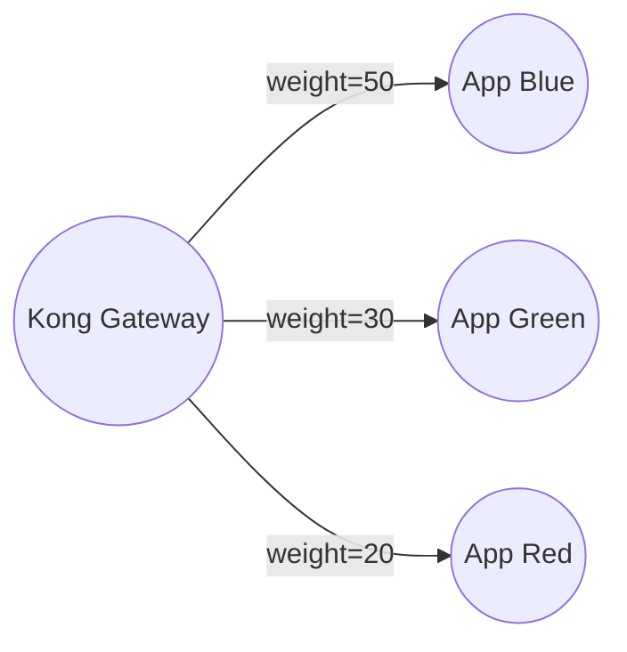

# Kong: Blue/Green deployment

## Architecture



## Setup

```sh
docker-compose up -d
```

## Output

```sh
# for ((i = 0; i < 30; i++)) { curl -Ss http://localhost:8000; echo "" }

{"msg":"Hello from red"}
{"msg":"Hello from blue"}
{"msg":"Hello from green"}
{"msg":"Hello from blue"}
{"msg":"Hello from blue"}
{"msg":"Hello from green"}
{"msg":"Hello from green"}
{"msg":"Hello from blue"}
{"msg":"Hello from red"}
{"msg":"Hello from blue"}
{"msg":"Hello from red"}
{"msg":"Hello from blue"}
{"msg":"Hello from green"}
{"msg":"Hello from blue"}
{"msg":"Hello from blue"}
{"msg":"Hello from green"}
{"msg":"Hello from green"}
{"msg":"Hello from blue"}
{"msg":"Hello from red"}
{"msg":"Hello from blue"}
{"msg":"Hello from red"}
{"msg":"Hello from blue"}
{"msg":"Hello from green"}
{"msg":"Hello from blue"}
{"msg":"Hello from blue"}
{"msg":"Hello from green"}
{"msg":"Hello from green"}
{"msg":"Hello from blue"}
{"msg":"Hello from red"}
{"msg":"Hello from blue"}
```
